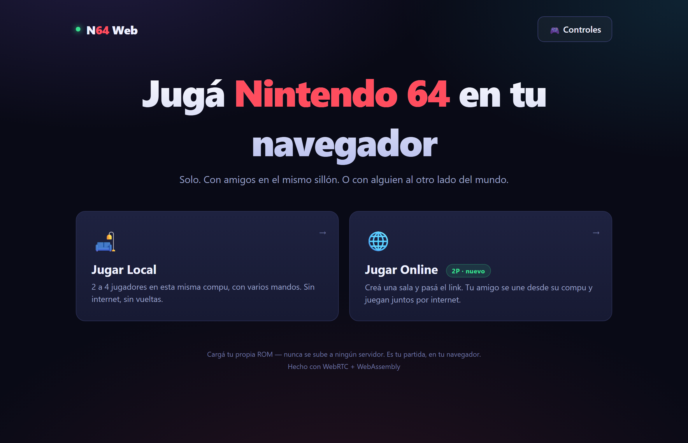

# N64 Web 🎮


**Nintendo 64 multijugador en el navegador.** Sin instalar nada: entrás, cargás
tu ROM y jugás — con mandos en el mismo sillón, o con un amigo al otro lado del
mundo vía WebRTC peer-to-peer.

**🔗 Demo en vivo:** https://n64-web.axelromero99.workers.dev



> **Privacidad por diseño:** cada jugador carga su propia ROM desde su disco y
> esta **nunca sale de su navegador**. El juego online viaja P2P entre los dos
> peers; el servidor solo hace el handshake y no ve un solo frame.

## Qué hace

| Modo | Qué es |
|------|--------|
| 🛋️ **Local (2-4 jugadores)** | Emulación N64 completa en tu PC (WASM), hasta 4 mandos USB. Sin latencia. |
| 🌐 **Online (2 jugadores)** | El host emula y transmite el video por WebRTC; el invitado manda su input. Con **modo justo** para eliminar la ventaja del host. |

Probar el online lleva un minuto: *Jugar Online → Crear una sala → cargar ROM →
Copiar link de invitación* y pasárselo a alguien (o abrirlo en una ventana de
incógnito).

## Arquitectura

```
  HOST (navegador)                          GUEST (navegador)
  ┌──────────────────────┐  video (WebRTC)  ┌──────────────────────┐
  │ EmulatorJS · WASM    │ ───────────────► │ <video> de baja      │
  │ (mupen64plus_next)   │                  │ latencia             │
  │ + modo justo (delay) │ ◄─────────────── │ teclado / gamepad    │
  └──────────┬───────────┘  input (4 bytes) └──────────┬───────────┘
             │                                         │
             └────────► /signal (WebSocket) ◄──────────┘
                 Cloudflare Worker + Durable Object
              (1 sala = 1 DO · solo handshake · hiberna)
```

```
src/
├─ core/emulatorjs.ts   Core N64 (EmulatorJS, versión fijada) para local + host
├─ net/
│  ├─ signaling.ts      WebSocket con cola + reconexión (dev: plugin Vite · prod: DO)
│  ├─ rtc.ts            ICE/TURN, RTT real, y helpers anti-razas de señalización
│  └─ online.ts         Sesión WebRTC: video, input, modo justo, ciclo de vida
├─ input/n64.ts         Modelo del mando (empaquetado en 32 bits) + presets
└─ ui/                  Pantallas y componentes (vanilla TS, sin framework)

worker/signaling.js     Señalización en producción (Worker + Durable Object)
```

Un solo Worker de Cloudflare sirve el frontend estático **y** la señalización
same-origin. Como el juego en sí es P2P, el costo del servidor es ~cero y todo
entra en el free tier.

## Decisiones de ingeniería

### El "modo justo": emparejar el timing de input, no prometer magia

El online por streaming es asimétrico por naturaleza: el host juega local sin
lag y el invitado sufre red + codificación de video. En vez de ignorarlo (como
hace la mayoría), el host juega con sus propios inputs **retrasados la latencia
de ida del invitado**, medida en vivo contra `getStats()` del par ICE (RTT/2,
acotado a 16-120 ms). La latencia de video del invitado no desaparece —es
inherente al streaming— pero la **ventaja de reacción del host se reduce
fuertemente** al meterle a él el mismo handicap de timing de input. Se apaga en
caliente desde la UI.

> **Honestidad sobre el alcance:** el handicap compensa el viaje del *input*
> (RTT/2), no el pipeline de *video* del invitado (codificación + jitter), así
> que empareja el timing de reacción sin igualarlo al 100 %. Y solo intercepta
> **teclado**: un host con gamepad USB lo evade. Es una mejora medible y
> honesta, no una promesa de paridad perfecta — para eso haría falta netcode
> determinista, inviable con este core (ver abajo).

### Streaming host-authoritative: una decisión medida, no una limitación aceptada

Antes de elegir esta arquitectura se midió la alternativa (netcode rollback
sobre el core existente) con Playwright y una ROM real: los savestates de
mupen64plus_next en WASM pesan **16 MB y tardan ~8.5 ms** — guardar/rebobinar
estado 60 veces por segundo es inviable en el navegador (un buffer de 2 s serían
~1.9 GB de RAM). El streaming P2P con compensación de input es la arquitectura
que sí entrega multijugador jugable hoy. La medición completa y reproducible
está en [`docs/M0-findings.md`](./docs/M0-findings.md)
(`node scripts/m0-ejs.mjs`).

### Conexiones que sobreviven al mundo real

La parte difícil de WebRTC no es el happy path, es todo lo demás:

- **Señalización serializada + buffer de candidatos ICE**: un `ice` que llega
  mientras `setRemoteDescription` sigue pendiente no se pierde (la causa
  clásica de "a veces no conecta").
- **`disconnected` ≠ muerto**: un blip de WiFi tiene 5 s de gracia antes de
  declarar la caída; recién ahí el guest recrea la sesión y **se reconecta
  solo** a la misma sala.
- **Sin estado fantasma**: si el invitado se cae con el acelerador apretado, el
  input de P2 se resetea al instante (datachannel `onclose` + teardown); la
  sala queda abierta para que vuelva a entrar.
- **TURN opcional con fallback**: para NAT muy cerrados (~5-10 % de los pares),
  un endpoint `/turn` mintea credenciales efímeras de Cloudflare Realtime.
  Sin configurar, todo degrada silenciosamente a STUN. Activación en 3 pasos:
  [`DEPLOY.md`](./DEPLOY.md).

### Señalización mínima y endurecida

Una sala = una instancia de Durable Object que solo relayea mensajes (con
WebSocket Hibernation las salas inactivas no cuestan nada). Como es un relay
público, tiene límites reales, **espejados en el server de dev** para que lo
que pasa en dev pase en prod:

| Límite | Respuesta |
|--------|-----------|
| Código de sala fuera de `[A-Z0-9]{4,8}` | HTTP 400 |
| 3er socket en una sala | close `4001` → la UI dice "sala llena" |
| Mensaje no-texto o > 32 KB | close `1009` |
| Flood (> 500 mensajes/socket) | close `1008` |
| `Origin` ajeno | HTTP 403 |

Detalle completo: [`docs/signaling-cloudflare.md`](./docs/signaling-cloudflare.md).

### Detalles que no se ven pero se sienten

Codecs VP9/H264 preferidos sobre VP8 con bitrate alto y jitter buffer al
mínimo (menos latencia de video); versión del core WASM **fijada** (un update
sorpresa del CDN no puede romper prod); hooks de debug expuestos solo en dev o
con `?debug=1`; cabeceras COOP/COEP para cross-origin isolation; UI operable
por teclado, con estados de carga/error en cada pantalla y mensajes concretos
("sala llena", "no encuentro esa sala", "reintentando…") en vez de spinners
infinitos.

## Testing: e2e contra la ROM real, casos de fallo incluidos

Nada se marca como funcionando sin un script que lo pruebe de punta a punta
con Playwright — con emulador real, ROM real y dos contextos de navegador
aislados (equivalente a dos máquinas). Los casos de **fallo** son ciudadanos de
primera: sala inexistente, sala llena, desconexión abrupta a mitad de partida.

```bash
npm run verify:quick   # sin ROM: UI y casos de fallo (~1 min)
npm run verify:all     # suite completa con ROM real (~10 min)
```

| Script (`npm run …`) | Qué prueba |
|--------|-----------|
| `verify:ui` | UI + accesibilidad: navegación por teclado, modal, autofocus |
| `verify:badcode` | código de sala inexistente → aviso claro, sin spinner infinito |
| `verify:online` | e2e completo: invite link, conexión, video no-negro, input, modo justo, sala llena |
| `verify:controls` | esquema de controles unificado host + guest (polaridad y deflexión del stick) |
| `verify:fair` | el input del host pasa por la ruta con delay cuando hay guest |
| `verify:disconnect` | caída abrupta del guest → input de P2 reseteado → re-join OK |
| `verify:worker` | límites del Durable Object contra `wrangler dev` (workerd real) |
| `verify:prod` | el sitio desplegado: cabeceras, conexión e2e y video en vivo |

Todos devuelven exit code ≠ 0 si algo falla — listos para CI.

## Correr en local

```bash
npm install
npm run dev        # http://localhost:5173 — incluye la señalización WebSocket
npm run build      # typecheck estricto + bundle (~29 KB gzip 11 KB)
```

Para probar el online en una sola PC: una pestaña normal crea la sala y una de
incógnito abre el link de invitación.

## Desplegar (gratis, un comando)

```bash
npx wrangler login     # una vez
npm run deploy         # build + deploy del Worker (frontend + señalización)
```

Paso a paso, más la activación opcional de TURN: [`DEPLOY.md`](./DEPLOY.md).

## Limitaciones conocidas

- El online es de **2 jugadores** (host + invitado) por sala.
- El invitado ve el juego con la latencia propia del streaming (red +
  codificación); el modo justo empareja el *timing de input*, no borra esa
  latencia.
- En pantallas táctiles hace falta un teclado o mando físico (la UI lo avisa).

## Stack

**TypeScript** (strict, sin framework de UI) · **Vite** · **WebAssembly**
(EmulatorJS / mupen64plus_next) · **WebRTC** (video + datachannel + STUN/TURN)
· **Cloudflare Workers + Durable Objects** · **Playwright** para la
verificación e2e.

## Legalidad y licencia

Emular no es ilegal; distribuir ROMs sí. Este proyecto **no incluye ni
distribuye ROMs**: cada usuario carga la suya y nunca sale de su navegador.

Código bajo licencia MIT — ver [`LICENSE`](./LICENSE).
