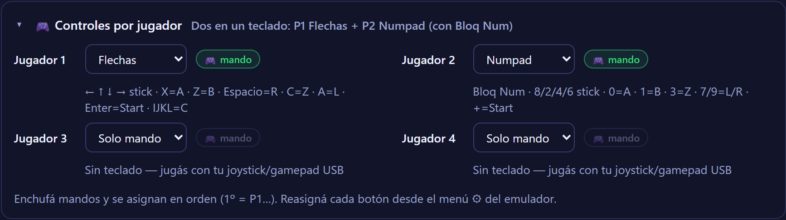

# N64 Web


Emulador de Nintendo 64 en el navegador, multijugador. Cargás tu ROM y jugás:
hasta cuatro con mandos en la misma máquina, o dos por internet con streaming
peer-to-peer sobre WebRTC. Sin instalar nada y sin backend de juego.

**Demo:** https://n64-web.axelromero99.workers.dev


Las ROMs no salen del navegador: cada jugador carga la suya desde su disco. En
online el juego viaja P2P entre los dos pares; el servidor solo hace el
handshake y no ve un frame.

## Modos

- **Local — hasta 4 jugadores.** Emulación completa en WebAssembly, sin latencia.
  Cada jugador elige su esquema de control desde la UI (flechas, numpad, WASD o
  mando). Los mandos se detectan y se asignan en orden (1º → P1, 2º → P2…).
- **Online — 2 jugadores.** El host emula y transmite el video por WebRTC; el
  invitado manda solo su input (4 bytes por cambio de estado). El *modo justo*
  (más abajo) empareja el timing de reacción entre ambos.

## Arquitectura

```
  HOST (navegador)                          GUEST (navegador)
  ┌──────────────────────┐  video (WebRTC)  ┌──────────────────────┐
  │ EmulatorJS · WASM    │ ───────────────► │ <video> low-latency  │
  │ (parallel_n64)       │                  │                      │
  │ + modo justo (delay) │ ◄─────────────── │ teclado / gamepad    │
  └──────────┬───────────┘  input (4 bytes) └──────────┬───────────┘
             │                                         │
             └────────► /signal (WebSocket) ◄──────────┘
                 Cloudflare Worker + Durable Object
              (1 sala = 1 DO · solo handshake · hiberna)
```

```
src/
├─ core/emulatorjs.ts   Core N64 (EmulatorJS, versión fijada) + presets de control local
├─ net/
│  ├─ signaling.ts      WebSocket con cola y reconexión (dev: plugin Vite · prod: DO)
│  ├─ rtc.ts            ICE/TURN, RTT real y helpers contra razas de señalización
│  └─ online.ts         Sesión WebRTC: video, input, modo justo, ciclo de vida
├─ input/n64.ts         Modelo del mando (empaquetado en 32 bits) + presets del guest
└─ ui/                  Pantallas y componentes (TS vanilla, sin framework)

worker/signaling.js     Señalización en producción (Worker + Durable Object)
```

Un solo Worker de Cloudflare sirve el frontend estático y la señalización, mismo
origen. Como el juego es P2P, el servidor no escala con la cantidad de partidas
y entra entero en el free tier.

## Decisiones de ingeniería

El proyecto se apoya en un core existente (EmulatorJS). Lo que le agrega valor no
es envolverlo, sino las decisiones alrededor: qué arquitectura de multijugador es
realista con ese core, y cómo hacerla robusta y verificable.

### Por qué streaming host-authoritative y no rollback

La opción "correcta" para multijugador sería netcode determinista (rollback),
pero antes de descartarlo lo medí en vez de asumirlo. Un savestate del core N64
en WASM pesa **~16 MB** y tarda **~8.5 ms** (MK64 real, Playwright). Rollback
necesita guardar y restaurar estado 60 veces por segundo; un buffer de 2 s serían
~1.9 GB de RAM, inviable en el navegador. Con esa medición, la arquitectura que sí
entrega multijugador jugable hoy es streaming P2P con compensación de input. La
medición es reproducible: [`docs/M0-findings.md`](./docs/M0-findings.md)
(`node scripts/m0-ejs.mjs`).

### Modo justo

El streaming es asimétrico: el host juega sin lag y el invitado carga la latencia
de red más la codificación de video. Para no ignorarlo, el host corre con su
propio input **retrasado la latencia de ida del invitado** —RTT/2 medido en vivo
con `getStats()` del par ICE, acotado a 16–120 ms.

No borra la latencia de video del invitado, que es inherente al streaming; le mete
al host el mismo handicap de timing y reduce su ventaja de reacción. Dos límites
que vale marcar: compensa el viaje del *input*, no el pipeline de *video*; y solo
intercepta teclado, así que un host con gamepad USB lo evade. Se apaga desde la
UI.

### WebRTC que sobrevive a una red real

El happy path de WebRTC es corto; lo demás es el trabajo:

- **Señalización serializada + buffer de candidatos ICE.** Un `ice` que llega con
  `setRemoteDescription` pendiente se encola en vez de perderse —la causa clásica
  del "a veces no conecta".
- **`disconnected` no es `closed`.** Un blip de WiFi tiene 5 s de gracia antes de
  declarar la caída; recién ahí el guest recrea la sesión y se reconecta solo a la
  misma sala.
- **Sin input fantasma.** Si el guest se cae con el acelerador apretado, el input
  de P2 se resetea en el `onclose` del datachannel; la sala queda libre para que
  vuelva a entrar.
- **TURN opcional con fallback a STUN.** Para NAT simétricos (~5–10 % de los
  pares), `/turn` mintea credenciales efímeras de Cloudflare Realtime. Sin
  configurarlo, degrada a STUN en silencio ([`DEPLOY.md`](./DEPLOY.md)).

### Señalización: un relay chico y acotado

Una sala es una instancia de Durable Object que solo relayea mensajes; con
WebSocket Hibernation las salas inactivas no cuestan nada. Al ser un relay
público tiene límites, **espejados en el server de dev** para que dev y prod se
comporten igual:

| Límite | Respuesta |
|--------|-----------|
| Código fuera de `[A-Z0-9]{4,8}` | HTTP 400 |
| 3er socket en la sala | close `4001` → UI "sala llena" |
| Mensaje binario o > 32 KB | close `1009` |
| Flood (> 500 msg/socket) | close `1008` |
| `Origin` ajeno | HTTP 403 |

Detalle: [`docs/signaling-cloudflare.md`](./docs/signaling-cloudflare.md).

### Controles de 4 jugadores, verificados sin hardware



El core soporta 4 jugadores pero por defecto solo mapea al Jugador 1: enchufar un
segundo mando no hacía nada. En vez de inventar un mapeo, saqué el de gamepad del
`defaultControllers` oficial de EmulatorJS (la versión que fijamos no trae
defaults propios, por eso hay que inyectarlos). Encima va un selector de preset
por jugador (flechas / numpad / WASD / mando) y un indicador que se enciende
cuando se detecta cada control.

Lo que hace distinta esta parte es que el test **maneja el emulador de verdad** y,
vía hook de `simulateInput`, confirma que cada tecla o botón llega al jugador
correcto —sin necesidad de cuatro joysticks físicos:

- **Teclado:** teclas reales (flechas → P1, WASD → P2). El numpad se prueba
  inyectando el `keyCode` exacto que produce con Bloq Num activado (104), porque
  el navegador headless fuerza NumLock en OFF. Ese detalle es un *footgun* real
  —sin Bloq Num el numpad manda flechas y pisa al P1—, así que la UI lo avisa en
  vivo.
- **Mando:** un gamepad virtual por la Gamepad API (`navigator.getGamepads`), para
  comprobar que EmulatorJS lo auto-asigna (1º → P1, 2º → P2) y que sus botones y
  stick mueven al core por el mismo camino que un control físico.

### Otros

Codecs VP9/H264 preferidos sobre VP8 con bitrate alto; versión del core WASM
**fijada** para que un update del CDN no rompa prod; hooks de debug expuestos solo
en dev o con `?debug=1`; cabeceras COOP/COEP para cross-origin isolation; UI
operable por teclado, con estados de carga y error explícitos en vez de spinners
sin fin ("sala llena", "no encuentro esa sala", "reintentando…").

## Tests

Nada se da por funcionando sin un script que lo ejercite de punta a punta con
Playwright: emulador real, ROM real y dos contextos de navegador aislados
(equivalen a dos máquinas). Los casos de fallo —sala inexistente, sala llena,
caída a mitad de partida— tienen la misma prioridad que el happy path.

```bash
npm run verify:quick   # sin ROM: UI y casos de fallo (~1 min)
npm run verify:all     # suite completa con ROM real (~10 min)
```

| Script (`npm run …`) | Qué prueba |
|--------|-----------|
| `verify:ui` | UI y accesibilidad: navegación por teclado, modal, autofocus |
| `verify:badcode` | código de sala inexistente → aviso claro, sin spinner infinito |
| `verify:online` | e2e completo: invite link, conexión, video no negro, input, modo justo |
| `verify:controls` | esquema de control unificado host + guest (polaridad y deflexión del stick) |
| `verify:multiplayer` | 4 jugadores: presets con teclas reales, aviso de NumLock y mando virtual (Gamepad API) manejando el core |
| `verify:fair` | el input del host pasa por la ruta con delay cuando hay guest |
| `verify:disconnect` | caída abrupta del guest → input de P2 reseteado → re-join OK |
| `verify:worker` | límites del Durable Object contra `wrangler dev` (workerd real) |
| `verify:prod` | el sitio desplegado: cabeceras, conexión e2e y video en vivo |

Todos devuelven exit code ≠ 0 ante un fallo, listos para CI.

## Desarrollo

```bash
npm install
npm run dev        # http://localhost:5173 — incluye la señalización WebSocket
npm run build      # typecheck estricto + bundle (~13 KB JS gzip, sin framework)
```

Para probar el online en una sola máquina: una pestaña normal crea la sala y una
de incógnito abre el link de invitación.

## Deploy

```bash
npx wrangler login     # una vez
npm run deploy         # build + deploy del Worker (frontend + señalización)
```

Paso a paso y activación opcional de TURN: [`DEPLOY.md`](./DEPLOY.md).

## Limitaciones conocidas

- El online es de 2 jugadores por sala (host + invitado).
- El invitado ve el juego con la latencia propia del streaming; el modo justo
  empareja el timing de input, no la elimina.
- En pantallas táctiles hace falta teclado o mando físico (la UI lo avisa).

## Stack

TypeScript (strict, sin framework de UI) · Vite · WebAssembly (EmulatorJS,
core `parallel_n64`) · WebRTC (video + datachannel + STUN/TURN) · Cloudflare
Workers y Durable Objects (SQLite-backed, free tier) · Playwright para los e2e.

## Legalidad y licencia

Emular no es ilegal; distribuir ROMs sí. Este proyecto no incluye ni distribuye
ROMs: cada usuario carga la suya y nunca sale de su navegador.

Código bajo licencia MIT — ver [`LICENSE`](./LICENSE).
